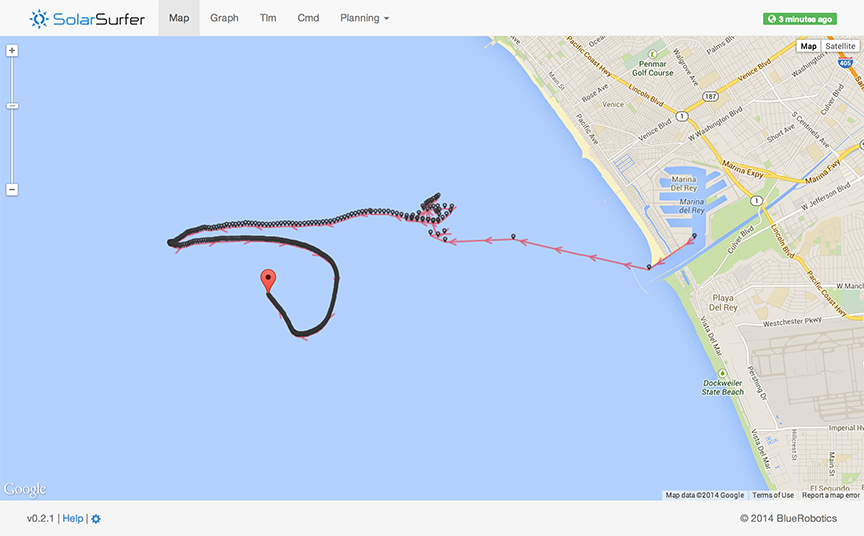

# NOTICE: This project is no longer maintained.
Blue Robotics has chosen to retire this project, it is no longer maintained or supported. Bug reports and feature requests are no longer accepted.  The repository has been archived and made read-only. The source is still available and can be forked, but this project may be permanently removed from GitHub in the future. For questions and further information, check out the Blue Robotics [discussion forums](https://discuss.bluerobotics.com) and [Gitter channel](https://gitter.im/bluerobotics/discussion).

# SolarSurferCommander

Navigation planner and command builder for the [SolarSurfer](http://bluerobotics.com/) project.



## Overview

This script is used to estimate the total travel profile of the SolarSurfer. While written in JavaScript, this package isn't normally hosted anywhere, so you'll have to download and run it yourself to see it.

The bulk of the planning calculations takes place in `app/scripts/SolarSurferPlanner.js`. The planner uses these packages:

* [moment.js](http://momentjs.com/) for working with date and time objects
* [js-quantities](http://gentooboontoo.github.io/js-quantities/) for dealing with units
* [Angular Google Maps](http://angular-google-maps.org/) for Angular directives for Google Maps
* [Google Maps Geometry Library](https://developers.google.com/maps/documentation/javascript/reference#spherical) for converting between distances and lat, long
* [Highcharts](http://api.highcharts.com/highcharts) for plotting data
* [Lo-Dash](http://lodash.com/) for handy utility functions

## Usage

Clone the repo, install the code, and start the server like this:

```bash
git clone https://github.com/bluerobotics/SolarSurferCommander.git
cd SolarSurferCommander
npm install
npm start
```

The planner should now be available at [http://localhost:4444/](http://localhost:4444/). The planner prints out most of useful information to the JavaScript console, so open that up to interact with the planner.

You can also push the website to a static content host with:

```bash
npm install
npm run-script build
npm run-script upload
```

## Change History

This project uses [semantic versioning](http://semver.org/).

### v0.2.4 - 2014/10/future

* Can now command through the GUI
* Utilize new GPS time to clean up derived data (tlm >= version 2)
* Lots of bug fixes

### v0.2.3 - 2014/10/09

* Can now configure vehicles and missions
* Can now select a different mission to view in the GUI
* Updated mission planner for Monterey / California coastline trip

### v0.2.2 - 2014/09/30

* Converted graph timestamps to the browser's local timezone
* Added velocity calculations to the power graph

### v0.2.1 - 2014/08/09

* Refactored "current mission" page into separate pages for better iOS use
* Added apple-touch-icon for better "add to home screen" experience on iOS
* Live-updating telemetry
* Map
  * Added individual markers for each telemetry message (black markers)
  * Added a marker for the latest position (red marker)
  * Added a marker for the user's current position (green marker)
  * Fixed direction of arrows on SolarSurfer path
* Graph
  * Enabled x-zooming
  * Fixed timestamps
  * Added voltage plots

### v0.2.0 - 2014/08/08

* Refactored from SolarSurferPlanner to SolarSurferCommander
* Used for the Santa Monica Canyon Test Day 1

### v0.1.0 - 2014/06/25

* Initial release

## Todo

* TODO: Relocated shared components to SolarSurferAngularComponents
* marker pop-up with date, gps coords, speed, current waypoint #
* build-your-own graphs / plots
* overlay planned waypoints by parsing command messages
* create a solar energy calculator from the [ITACA equations](http://www.itacanet.org/the-sun-as-a-source-of-energy/) and overlay maximum solar energy / time
  * create this as a separate repository for browser and node
* auto select a position on the map when click a point in a graph
* Use HTML5 localstorage to speed up subsequent data access
* brunch doesn't copy .htaccess to _public
